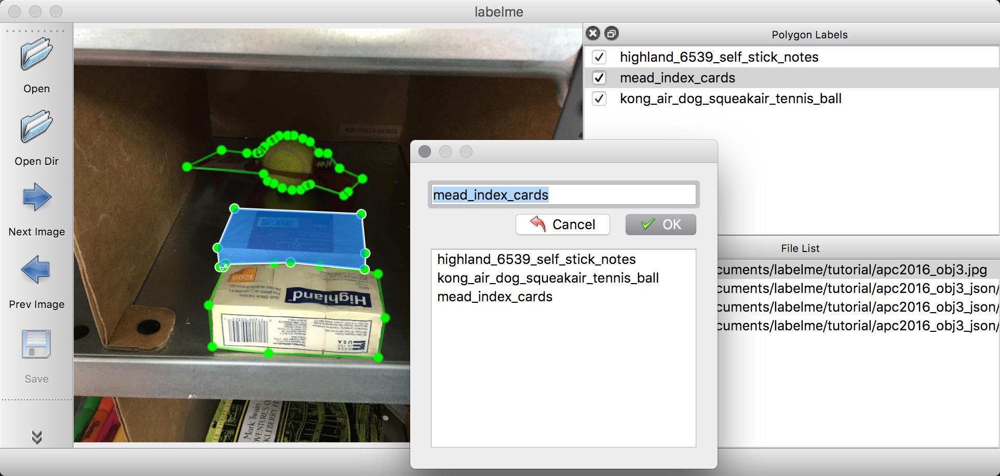
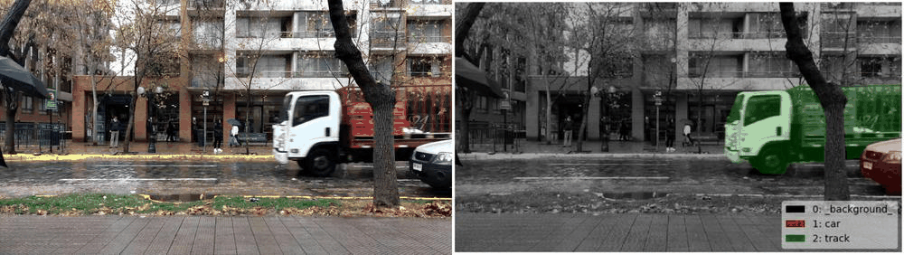
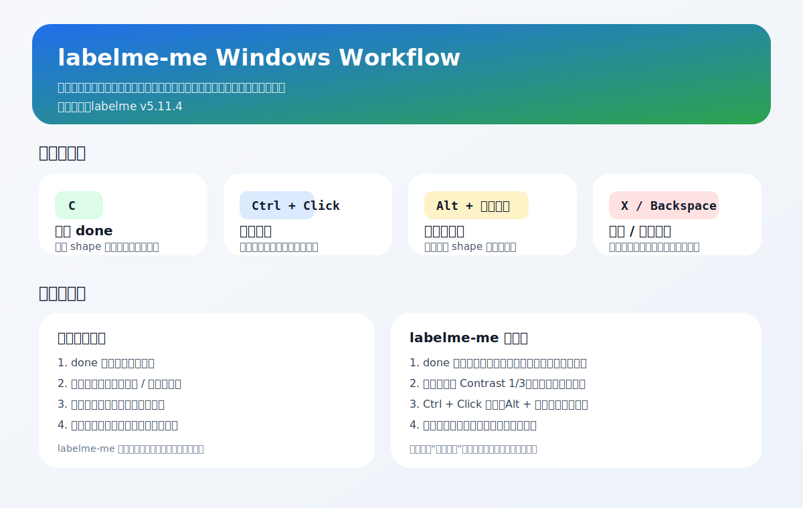

# labelme-me

<div align="center">

基于上游 [`labelme v5.11.4`](https://github.com/wkentaro/labelme/tree/v5.11.4) 的 Windows 定制版标注工具。

[](https://github.com/pbobip/labelme-me/releases)
[](LICENSE)
[](https://github.com/wkentaro/labelme/tree/v5.11.4)

</div>

这个 fork 不是为了大改 `labelme` 的整体架构，而是为了把日常标注时最痛的几个交互问题直接改掉，重点服务 Windows 下的人工标注流程。

## 为什么做这个 fork

原版 `labelme` 在我这套标注场景里有几个稳定痛点：

- `done` 状态不够顺手，缺少快速切换和直观反馈
- 对比度切换要进弹窗，频率高时很打断节奏
- 加点、删点、多点处理的操作不够顺手
- 顶部“删除当前标注文件”按钮容易误触

这个仓库就是围绕这些点做定制，不追求“功能越多越好”，只追求**日常标注更顺手、更稳、更少误操作**。

## Preview

### 标注界面



上图是 `Labelme` 基础标注界面示例，用来说明这类工具的主界面形态。

### 视频标注示例



上图是仓库自带的示例 GIF，用来展示整体标注流。

### 定制工作流总览



这张图对应本仓库实际新增的快捷键和工作流改动。

## 核心特性

### 标注状态

- 选中 shape 后按 `C`，切换 `done`
- 右侧对象列表显示 `[DONE]`
- `done=true` 的 shape 直接变绿色
- 默认提供对象级标记：`done / checked / uncertain`

### 观察与显示

- 工具栏新增 `Contrast 1/3`
- 可在 `1x` 和 `3x` 对比度间快速切换
- 不需要每次打开亮度/对比度弹窗

### 控制点编辑

- `Ctrl + Click`：在边上添加控制点
- `X / Backspace`：删除当前选中的控制点
- `Alt + 左键拖框`：跨多个 shape 框选控制点
- 框选后按 `X / Backspace`：批量删除点

### 误操作保护

- 顶部工具栏隐藏“删除当前标注文件”按钮
- 菜单和原快捷键仍保留
- 降低误删 `JSON` 的概率

## 快速开始

### 方式 1：从源码安装

```powershell
git clone https://github.com/pbobip/labelme-me.git
cd labelme-me
powershell -ExecutionPolicy Bypass -File .\scripts\install_windows_custom.ps1
```

### 方式 2：从 Release 安装

1. 打开 [Releases](https://github.com/pbobip/labelme-me/releases)
2. 下载 zip 包
3. 解压后执行：

```powershell
powershell -ExecutionPolicy Bypass -File .\scripts\install_windows_custom.ps1
```

### 启动

默认安装脚本会在仓库目录下创建 `.venv`，启动命令：

```powershell
.\.venv\Scripts\labelme.exe
```

## 推荐使用流程

安装后建议先验证这几项：

1. 工具栏能看到 `Contrast 1/3`
2. 顶部工具栏不再显示“删除当前标注文件”按钮
3. 选中 shape 后按 `C`，状态会切换
4. `Ctrl + Click` 可以在边上加点
5. `Alt + 左键拖框` 后按 `X` 可以批量删点

## 常用快捷键

| 功能 | 快捷键 |
| --- | --- |
| 切换 `done` | `C` |
| 删除控制点 | `X` / `Backspace` |
| 在边上加点 | `Ctrl + Click` |
| 框选控制点 | `Alt + 左键拖框` |
| 保存 | `Ctrl + S` |
| 打开目录 | `Ctrl + U` |

## 文档

- [功能说明](docs/CUSTOM_FEATURES.md)
- [Windows 安装教程](docs/WINDOWS_INSTALL.md)
- [首版发布说明](docs/RELEASE_NOTES_v5.11.4-custom.1.md)

## 仓库里的辅助内容

```text
config/
  .labelmerc.example
docs/
  CUSTOM_FEATURES.md
  WINDOWS_INSTALL.md
  RELEASE_NOTES_v5.11.4-custom.1.md
scripts/
  install_windows_custom.ps1
  build_release_zip.ps1
```

## 面向开发者

这个仓库是一个**完整源码 fork**，不是补丁仓库。

- 上游基线：`labelme v5.11.4`
- 当前主要定制文件：
  - `labelme/app.py`
  - `labelme/widgets/canvas.py`
  - `config/.labelmerc.example`

如果后续要继续维护，建议：

1. 通过 `upstream` 远程跟踪上游
2. 按版本同步，不要直接覆盖本地定制
3. 每次同步后先验证 `done`、`Contrast 1/3`、加点删点这几条核心流程

## 发布 Release

仓库自带打包脚本：

```powershell
powershell -ExecutionPolicy Bypass -File .\scripts\build_release_zip.ps1
```

执行后会在仓库外层生成 zip 包，适合直接上传到 GitHub Release。

## 致谢

- Upstream project: [wkentaro/labelme](https://github.com/wkentaro/labelme)
